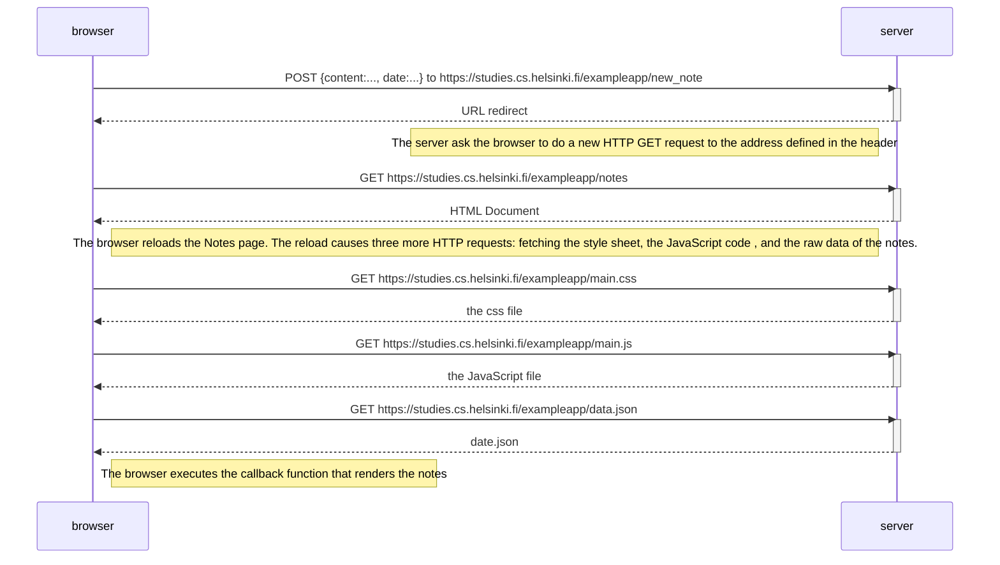

# New note diagram

```mermaid
sequenceDiagram
    participant browser
    participant server

    browser->>server: POST {content:..., date:...} to https://studies.cs.helsinki.fi/exampleapp/new_note

    activate server
    server-->>browser: URL redirect
    deactivate server
    Note left of server: The server ask the browser to do a new HTTP GET request to the address defined in the header
    browser->>server: GET https://studies.cs.helsinki.fi/exampleapp/notes
    activate server
    server-->>browser: HTML Document
    deactivate server

 Note right of browser: The browser reloads the Notes page. The reload causes three more HTTP requests: fetching the style sheet, the JavaScript code , and the raw data of the notes.

    browser->>server: GET https://studies.cs.helsinki.fi/exampleapp/main.css
    activate server
    server-->>browser: the css file
    deactivate server

    browser->>server: GET https://studies.cs.helsinki.fi/exampleapp/main.js
    activate server
    server-->>browser: the JavaScript file
    deactivate server

    browser->>server: GET https://studies.cs.helsinki.fi/exampleapp/data.json
    activate server
    server-->>browser: date.json
    deactivate server

    Note right of browser: The browser executes the callback function that renders the notes
```
